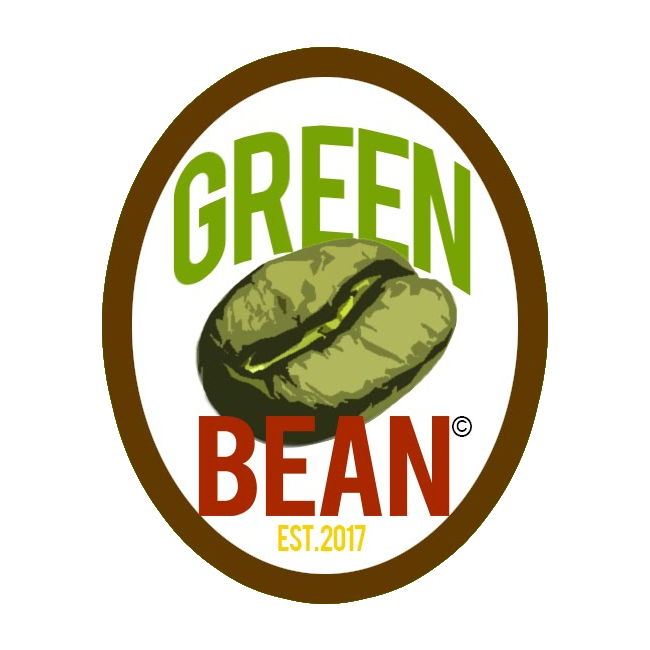

# Green Bean Coffee Collective (`greenbean.app`)

> **"Worker-owned, community-powered coffee. Sourced ethically, roasted locally, and rooted in our neighborhood."**



[](https://greenbean.app)
[](#origin--vision)
[](#roadmap)
[](https://www.python.org/)
[](https://www.djangoproject.com/)
[](https://astral.sh/uv)

---

## 1. Origin & Cooperative Vision

**Green Bean** was conceptualized and schemed in **2017** as an intentional, anti-extractive counterweight to corporate coffee conglomerates that extract capital from neighborhoods, commodify agricultural producers, and exploit frontline service labor.

Operating as an independent **Operating Company (OpCo)**, Green Bean combines:
1. **Worker Ownership**: Roasters, baristas, logistics staff, and community stewards collectively hold the operating equity and governance authority.
2. **Direct Ethical Trade**: Transparent direct-trade partnerships with single-origin smallholder growers and regenerative farms at pricing well above fair-trade floors.
3. **Hyper-Local Artisanal Roasting**: Precision batch-roasting honoring origin characteristics, terroir, and harvest seasonality.
4. **Community Mesh Integration**: Digital sovereignty via an open-standard, federated web platform (`greenbean.app`) integrated into democratic capital distribution engines.

---

## 2. Technical Overview

The platform is designed as a **resilient, lightweight Python/Django web engine** prioritizing low latency, zero external runtime lock-in, and clean boundary separation for federation into ecosystem services:

- **Runtime & Toolchain**: Python >= 3.12 managed with `uv`.
- **Framework**: Django 6.x / 5.2+ with zero-dependency static delivery via WhiteNoise.
- **Namespaced Security**: Strict cookie namespaces (`greenbean_sessionid`, `greenbean_csrftoken`) and signed cookie sessions.
- **Decoupled Architecture**: Scaffolding built for multi-channel ordering, curbside arrival telemetry, and modular adapter bridges (`iyou_bean`, `iyou_poly`, `iyou_coop`).

---

## 3. Quickstart & Local Development

### Prerequisites
- [uv](https://docs.astral.sh/uv/) (v0.5+) installed.
- Python 3.12+.

### Installation & Environment Setup

```bash
# 1. Clone the repository
git clone git@github.com:dcbyers13/greenbean_dotapp.git
cd greenbean_dotapp

# 2. Synchronize dependencies using uv
uv sync

# 3. Create a local environment configuration
cp .env.example .env

# 4. Apply database migrations
uv run python manage.py migrate

# 5. Start the development server
uv run python manage.py runserver 127.0.0.1:8000
```

Visit [`http://127.0.0.1:8000/`](http://127.0.0.1:8000/) to view the Green Bean brand splash and mission presentation.

### Running Quality Gates & Tests

```bash
# Run Django test suite
uv run python manage.py test tests

# Run Django system sanity checks
uv run python manage.py check
```

---

## 4. Documentation Suite

Full technical specifications, development guides, and strategic milestones are maintained in the repository:

- 🏛️ [**System Architecture**](docs/ARCHITECTURE.md): Monolith foundation, multi-form catalog patterns, curbside arrival telemetry, and adapter interfaces (`iyou_bean`, `iyou_poly`, `iyou_coop`).
- 🛠️ [**Developer Guide**](docs/GREENBEAN_DEVELOPER_GUIDE.md): Onboarding, design tokens, environment variables, and testing guidelines.
- 🗺️ [**Rollout Roadmap**](docs/ROADMAP.md): 5-Phase journey from Brand Splash to Federated Mesh Commerce.
- ✅ [**Action Tracker**](TODO.md): Granular execution checklist across all development phases.
- 🤖 [**Agent Rules of Engagement**](AGENT.md): Non-negotiable coding invariants, naming conventions, and quality gates.

---

## 5. Git Multi-Remote Infrastructure

Production code pushes are synchronized across distributed mirrors via the `pushall` composite remote:

- **GitHub Origin:** `git@github.com:dcbyers13/greenbean_dotapp`
- **QNAP Local NAS:** `ssh://iyou@qnap:/share/homes/iyou/repos/greenbean_dotapp.git`
- **VPS Edge Offsite:** `vps-offsite-backup:/home/gitbackup/greenbean_dotapp.git`

```bash
git push pushall main
```

---

## 6. License & Stewardship

&copy; 2017–Present Green Bean Coffee Collective. Worker-owned and community-stewarded. All rights reserved.
