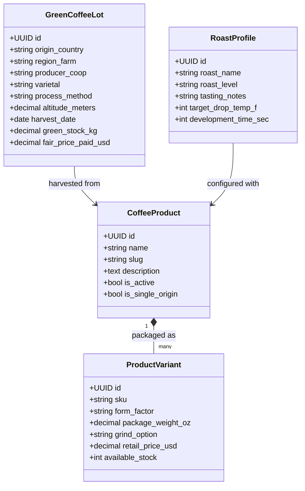
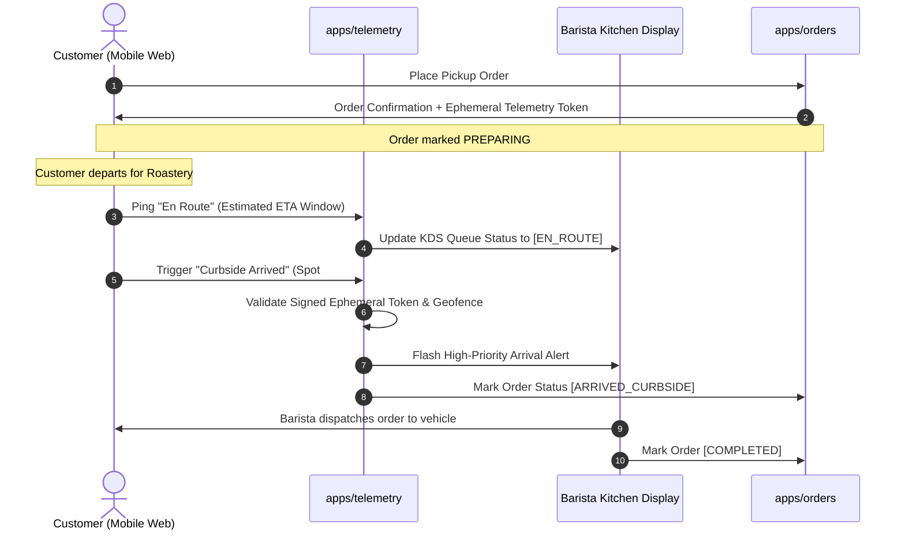

# Platform Architecture Specification: `greenbean_dotapp`

> **Domain:** `greenbean.app`  
> **Classification:** Commercial Operating Company (OpCo) Web Engine  
> **Foundation:** Modular Django Monolith & Federated Mesh Adapters  
> **Status:** Phase 1 Operational Scaffolding

---

## 1. System Philosophy & Monolith Foundation

The `greenbean_dotapp` platform is engineered as a **resilient, modular monolith** rather than a distributed microservice sprawl. Operating an artisanal, worker-owned coffee collective demands high operational cohesion, instant zero-latency transactions during in-shop rush periods, and uncompromising simplicity for local baristas and roasters.

```mermaid
flowchart TD
    subgraph Client Layer
        WebClient["Web / Mobile Browser (greenbean.app)"]
        BaristaKDS["Barista Kitchen Display System (KDS)"]
        CurbsidePWA["Curbside Telemetry Client"]
    end

    subgraph Core Monolith (Django 6.x)
        WSGI["WSGI / ASGI Gateway"]
        WhiteNoise["WhiteNoise Asset Pipeline"]
        
        subgraph Internal Domain Apps
            CoreApp["apps/core (Splash, Brand, Health)"]
            CatalogApp["apps/catalog (Multi-Form Coffee Inventory)"]
            OrdersApp["apps/orders (Fulfillment Engine)"]
            TelemetryApp["apps/telemetry (Curbside Arrival Engine)"]
            AdapterApp["apps/adapters (Federation Gateways)"]
        end
        
        DB[("PostgreSQL / SQLite Storage Engine")]
        SignedSessions["Signed Cookie Session Engine"]
    end

    subgraph Federated Cooperative Mesh
        IyouBean["iyou_bean (Double-Entry Ledger & Accounting)"]
        IyouPoly["iyou_poly (Democratic Profit Allocation)"]
        IyouCoop["iyou_coop (Federated Cooperative Discovery)"]
    end

    WebClient -->|HTTPS| WSGI
    BaristaKDS -->|Telemetry / WebSockets| WSGI
    CurbsidePWA -->|Arrival Signals| WSGI
    WSGI --> WhiteNoise
    WSGI --> CoreApp
    WSGI --> CatalogApp
    WSGI --> OrdersApp
    WSGI --> TelemetryApp
    WSGI --> SignedSessions

    OrdersApp --> DB
    CatalogApp --> DB
    TelemetryApp --> DB

    AdapterApp -.->|Signed Audit Payloads| IyouBean
    AdapterApp -.->|Patronage Metrics| IyouPoly
    AdapterApp -.->|Mesh Discovery & Catalog Sync| IyouCoop
```

### Architectural Guarantees
1. **Zero-Dependency Static Delivery**: Utilizing WhiteNoise to serve pre-compressed, cache-controlled static assets directly through the application process without requiring an external proxy container.
2. **Stateless Scalability**: Signed cookie session management (`SESSION_ENGINE = "django.contrib.sessions.backends.signed_cookies"`) eliminates state database lookups for unauthenticated visitors.
3. **Strict Security Isolation**: Distinct, non-overlapping cookie namespaces (`greenbean_sessionid`, `greenbean_csrftoken`) to prevent cross-app token collision across ecosystem subdomains.
4. **Isolated Domain Modules**: Clean modular structure inside `apps/`, where each domain handles its own models, services, and URL routing.

---

## 2. Multi-Form Coffee Catalog Engine

Unlike generic retail software, coffee exists across multiple evolving physical states: from unroasted green lot harvests, through roast batches, into packaged whole bean retail, ground retail, or immediate beverage extractions.

The `apps/catalog` engine models these multi-form transitions through strict inheritance and variant hierarchies:



### Form Factor Variations
- **Whole Bean Packages**: 12oz, 2lb, 5lb retail bags with valve sealing.
- **Grind Formulations**: Whole Bean, Coarse (French Press/Cold Brew), Medium (Drip/Auto-Drip), Medium-Fine (Chemex/Pour Over), Fine (Espresso), Extra Fine (Turkish).
- **Batch Beverage & Cold Brew**: Prepared ready-to-drink growlers, seasonal single-origin kegs, and espresso bar formulations.

---

## 3. Curbside Arrival Telemetry (`apps/telemetry`)

To enable seamless, frictionless pickup without requiring intrusive, battery-draining native background location tracking, Green Bean utilizes a **privacy-preserving, tokenized proximity handshake**:



### Privacy & Telemetry Invariants
- **No Persistent Coordinates**: The system never stores customer GPS latitude/longitude traces. Coordinates are evaluated ephemerally against the shop bounding circle on client device dispatch.
- **Ephemeral Access Tokens**: Arrive tokens expire within 2 hours of scheduled pickup windows.
- **Auditable Barista Dispatch**: Every handoff transition is signed by the active barista session for accountability.

---

## 4. Federated Ecosystem Adapters (`apps/adapters`)

Green Bean is an autonomous commercial entity that connects to the broader federated economic network through dedicated, non-blocking adapter interfaces:

```
apps/adapters/
├── iyou_bean/     # Financial ledger & COGS integration
├── iyou_poly/     # Democratic patronage & dividend distribution
└── iyou_coop/     # Inter-cooperative federation discovery
```

### A. `iyou_bean` — Double-Entry Financial Ledger
- **Role**: Synchronizes inventory debits, green coffee procurement, and retail sales revenue into an auditable immutable ledger.
- **Interface**: Implements `IyouBeanLedgerAdapter` with signed transaction batches (`POST /api/v1/ledger/sync/`).
- **Data Integrity**: Guarantees zero balance discrepancy between POS register reconciliation, credit processing, and bank accounts.

### B. `iyou_poly` — Democratic Profit Allocation & Governance
- **Role**: Ingests operational labor metrics (roast hours, barista shift units, logistics handling) to power automated patronage dividend distributions.
- **Interface**: Exports audited quarterly surplus data to `iyou_poly` governance contracts.
- **Worker Parity**: Ensures cooperative members receive equitable dividends based on actual value-creation formulas voted on by the collective assembly.

### C. `iyou_coop` — Brand Federation & Mesh Discovery
- **Role**: Publishes Green Bean roast schedules, guest bean rotations, and cooperative directory listings to federated sister cooperatives.
- **Interface**: Exposes read-only DID/Nostr-compatible mesh manifests (`/.well-known/coop-manifest.json`).
- **Inter-Cooperation**: Supports reciprocal ordering, inter-roaster green inventory swaps, and decentralized provenance verification.

---

## 5. Security & Boundary Enforcements

1. **Signed Session Cookies**: Sessions are cryptographically signed with HMAC-SHA256 (`django.contrib.sessions.backends.signed_cookies`), eliminating server-side session stores.
2. **Strict CSRF & Host Boundaries**: Only allowed hosts matching `greenbean.app` and trusted local development endpoints may execute modifying HTTP actions.
3. **Clean Code Isolation**: Business logic resides within service modules (`apps/*/services/`), keeping views and models thin and focused.
