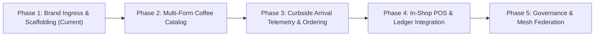

# Green Bean Rollout Roadmap (Phase 1 — Phase 5)

> **Strategic execution timeline for `greenbean_dotapp` (`greenbean.app`).**  
> Moving from initial brand ingress to a fully federated, worker-owned economic engine.

---

---

## Phase 1: Brand Ingress & Foundation Scaffolding (Current)
*Target Milestone: Q3 2026 — Complete*

- [x] Secure and configure commercial domain (`greenbean.app`).
- [x] Bootstrap clean Python 3.12+ runtime managed via `uv`.
- [x] Configure Django 6.x engine with WhiteNoise static compression and caching.
- [x] Enforce session and CSRF cookie namespacing (`greenbean_sessionid`, `greenbean_csrftoken`).
- [x] Implement brand design tokens matching original 2017 identity.
- [x] Scaffold responsive brand splash page featuring centered medallion and mission presentation.
- [x] Establish documentation suite (`ARCHITECTURE.md`, `DEVELOPER_GUIDE.md`, `ROADMAP.md`, `AGENT.md`).
- [x] Configure distributed Git multi-remote infrastructure (`pushall`: GitHub, QNAP NAS, VPS Offsite).
- [x] Complete automated test verification with zero warnings.

---

## Phase 2: Multi-Form Coffee Catalog & Inventory Engine
*Target Milestone: Q4 2026*

- [ ] Model green coffee harvest lots (`GreenCoffeeLot`): producer cooperative, altitude, varietal, fair price floor.
- [ ] Model roast profiles (`RoastProfile`): batch roast curves, tasting notes, development ratios.
- [ ] Implement multi-form product variants (`ProductVariant`):
  - Whole bean retail bags (12oz, 2lb, 5lb).
  - Multi-grind selections (Coarse, Medium, Chemex, Fine, Turkish).
  - Bulk roastery wholesale lots.
- [ ] Build inventory state machine tracking beans from unroasted green sacks to retail units.
- [ ] Develop administrative roaster portal for batch logging and stock adjustments.

---

## Phase 3: Digital Ordering & Curbside Arrival Telemetry
*Target Milestone: Q1 2027*

- [ ] Implement customer mobile storefront with responsive cart and bag customizer.
- [ ] Deploy real-time Barista Kitchen Display System (KDS) queue with WebSocket telemetry.
- [ ] Build privacy-preserving curbside arrival telemetry:
  - Ephemeral arrival tokens bound to scheduled order windows.
  - Zero-storage client geofence proximity pinging.
  - Barista vehicle/spot notification alerts.
- [ ] Implement transactional order updates (SMS and Web Push notifications).

---

## Phase 4: In-Shop POS & Financial Ledger Integration (`iyou_bean`)
*Target Milestone: Q2 2027*

- [ ] Develop touchscreen barista Point-of-Sale (POS) interface for front-counter register.
- [ ] Integrate local payment terminals (debit/credit, contactless, cash drawer kickers).
- [ ] Build `apps/adapters/iyou_bean` adapter bridge:
  - Real-time transaction batching to double-entry ledger.
  - COGS and green coffee procurement balance reconciliation.
  - End-of-day register closure and audit logging.

---

## Phase 5: Democratic Governance & Mesh Federation (`iyou_poly` & `iyou_coop`)
*Target Milestone: Q3 2027*

- [ ] Deploy `apps/adapters/iyou_poly` patronage allocation engine:
  - Ingest worker labor-hours and barista shift logs.
  - Compute quarterly patronage dividends according to cooperative assembly bylaws.
  - Provide worker equity dashboard.
- [ ] Deploy `apps/adapters/iyou_coop` federation gateway:
  - Expose decentralized cooperative discovery manifest (`/.well-known/coop-manifest.json`).
  - Enable inter-roaster guest coffee exchanges with allied regional cooperatives.
  - Implement distributed supply-chain provenance verification.
